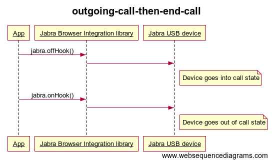
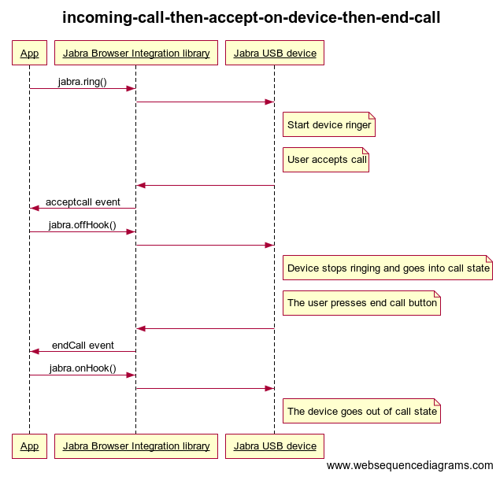
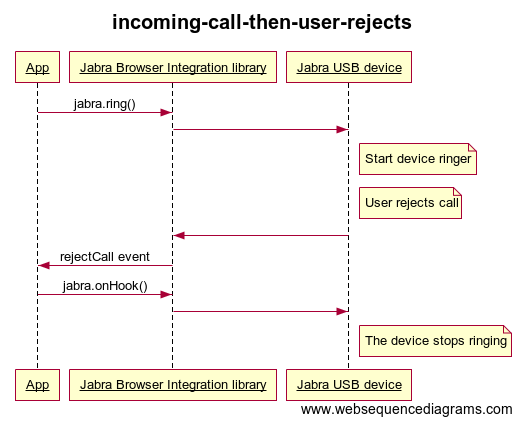
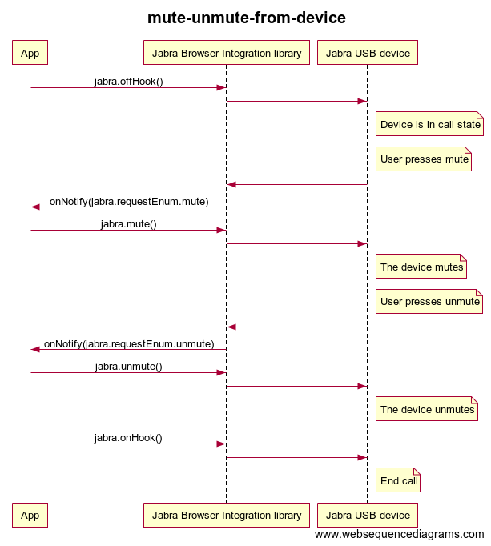
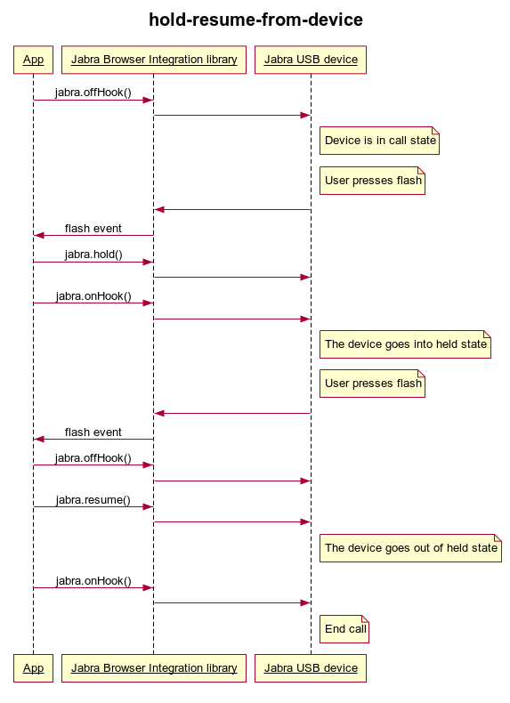

# Overview
This software project from Jabra helps developers to make solutions, where basic headset call control can be used from within a browser app using JavaScript. Since it is not possible to access USB devices directly from JavaScript, this library provides a solution of getting a route from the JavaScript to the Jabra USB device. The API is a JavaScript library with a facade that hides implementation details. Basic call control is defined by off-hook/on-hook, ringer, mute/unmute and hold/resume. With these features, it is possible to implement a browser based softphone app. Combined with the [WebRTC](https://en.wikipedia.org/wiki/WebRTC) technology it is possible to create a softphone that only requires small software components installed locally on the computer, while the business logic is implemented in JavaScript.

## Project goals
* be able to control a headset from JS
* be a lightweight solution
* support the platforms: Windows and macOS

## System requirements
With current internal implementation of this software package, the following is supported:

### Jabra devices
All professional Jabra headsets and Jabra speakerphones are supported. I.e. the [Jabra Evolve series](https://www.jabra.com/business/office-headsets/jabra-evolve), the Jabra Pro series, the Jabra Biz series, and the [Jabra Speak series](https://www.jabra.com/business/speakerphones/jabra-speak-series).

### Operating system support
The following desktop operating systems are supported:

| Operating system  | Version            | 
| ----------------- | ------------------ | 
| Windows 64 bit    | Windows 7 or newer | 
| Windows 32 bit    | Windows 7 or newer | 
| macOS             | El Capitan or newer| 

### Browser support
Google Chrome web browser - stable channel - 32 bit and 64 bit.

# Using the library
The solution consists of a Javascript API that webpages can consume, a chrome web extension and a native chromehost that must be installed separately. 

## Javascript/typescript API
Developers must use the versioned JavaScript library file with the format `jabra.browser.integration.<majorVersion>.<minorVersion>.js` and the associated 
[typescript *.d.ts](https://www.typescriptlang.org/) definition file which
documents the API in detail, including exactly what each API method expect for parameters and what each method returns.

These files adhere to semantic versioning
so increases in majorVersion between releases indicate breaking changes so developers using the software
may need to change their code when updating. Increases in minorVersion indicates that all changes are backwards compatible.

>*Tip: Use the supplied typescript file with a [reference path comment](https://www.typescriptlang.org/docs/handbook/triple-slash-directives.html) on top of your javascript files to get code completion for the Jabra API in many development tools.* 

Latest API versions are:

| API file downloads | Description |
| ----------------------------- | --------------------------------------- |
| [jabra.browser.integration-2.0.js](https://gnaudio.github.io/jabra-browser-integration/JavaScriptLibrary/jabra.browser.integration-2.0.js) | Javascript API client file |
| [jabra.browser.integration-2.0.d.ts](https://gnaudio.github.io/jabra-browser-integration/JavaScriptLibrary/jabra.browser.integration-2.0.d.ts) | Typescript definition file |

The library internally checks for dependencies – and will report this to the app using the library. An example: When trying to initialize Jabra library the promise might fail with an error “You need to use this Extension and then reload this page” if the browser extension is missing.

*Notice that the latest API contains [breaking changes](CHANGELOG.md) compared with previous 1.2 version as evident from the change in major version. See upgrade section below for help on upgrading your client code.*

## WebExtension
[](https://chrome.google.com/webstore/detail/jabra-browser-integration/okpeabepajdgiepelmhkfhkjlhhmofma)

## Native Chromehost downloads

| Operating systems             | Chrome host native download             | Description                             |
| ----------------------------- | --------------------------------------- | --------------------------------------- |
| Windows (Windows 7 or newer)  | [JabraChromeHost2.0.msi](https://gnaudio.github.io/jabra-browser-integration/download/JabraChromeHost2.0.0.msi) | Chromehost 2.0 |
| Windows (Windows 7 or newer)  | [JabraChromeHost0.51.msi](https://gnaudio.github.io/jabra-browser-integration/download/JabraChromeHost0.51.msi) | Security fix to allow beta testing |
| macOS (El Capitan or newer)     | [JabraChromeHost2.0.dmg](https://github.com/gnaudio/jabra-browser-integration/blob/master/downloads/JabraChromeHost2.0.0.dmg) | Chromehost 2.0 |
| macOS (El Capitan or newer)     | [JabraChromeHost0.5.dmg](https://gnaudio.github.io/jabra-browser-integration/download/JabraChromeHost0.5.dmg) | Old Mac release |

## CI builds

[macOS](https://gnaudio.visualstudio.com/jabra-browser-integration/_build?definitionId=138):


[Windows](https://gnaudio.visualstudio.com/jabra-browser-integration/_build?definitionId=139):


## Getting started with using the API in your web applications

First, make sure the [jabra library javascript file](https://gnaudio.github.io/jabra-browser-integration/JavaScriptLibrary/jabra.browser.integration-2.0.js) is included in your HTML page (use a local copy - don't link directly). 

Secondly, the library must be initialized using javascript like this:
```javascript
jabra.init().then(() => {
// Handle success

}).catch((err) => {
// Handle error
});

```
Generally, you will also need to setup various
event handlers, like for example for when a new Jabra device has been attached to the computer or when the device has requested to be muted *(just be aware that some events are only send if the device is in a specific state. For example, mute is only send when the device is off hook)*:

```javascript
jabra.addEventListener("device attached", (event) => {
 // Handle new device 
});

jabra.addEventListener("mute", (event) => {
 // Handle mute event.
});

```

When issuing commands, this API only works with one (active/selected) jabra device at the time *(only an issue if you have multiple Jabra devices connected at the same time)*. You can easily issue specific commands to the active device like this example:

```javascript
jabra.offHook();

```

Importantly, please do consult the
[typescript definition file](https://gnaudio.github.io/jabra-browser-integration/JavaScriptLibrary/jabra.browser.integration-2.0.d.ts) for a full description of how to use the API. See also the [source code for the examples](https://github.com/gnaudio/jabra-browser-integration/tree/master/src/DeveloperSupportRelease) listed below for usage details. 


For many editors and IDE's, the above typescript definition file can be used to provide code completion and context sensitive help. For example for Visual Code, this requires top-level comment like this to your javascript source file:

```javascript
/// <reference path="<your-path-to-a-local-copy-here>/jabra.browser.integration-2.0.d.ts" />
```

## Development tools/demos
* [Call control test](https://gnaudio.github.io/jabra-browser-integration/release/development/) - test page to try out basic call control in the library
* [Library api test](https://gnaudio.github.io/jabra-browser-integration/release/test/) - advanced test page that allows detailed testing of individual API calls)
* [Playback demo with auto selection](https://gnaudio.github.io/jabra-browser-integration/release/playback/) - demo page showing auto selection of jabra device with simple audio playback example
* [WebRTC softphone demo](https://gnaudio.github.io/jabra-browser-integration/release/webrtc/) - demo that supports mute/unmute/end-call from a Jabra device + jabra device auto selection
* [Amazon Connect client demo](https://gnaudio.github.io/jabra-browser-integration/release/amazonconnectclient/) - demo showing Jabra and [Amazon Connect](https://aws.amazon.com/connect) integration

## Sequence diagrams

These sequence diagrams shows typical use of the browser sdk:











## Deployment

Documentation about [mass deployment](docs/Deployment.md)

## Logging
The extension, chromehost and api has logging support that can be used to diagnose errors. 

Logging for javascript components can be seen in the browser developer console for the application and for the background page of the extension (a link is provided under chrome
extensions when developer mode is selected). The log level (how much is being logged) can be controlled by right-clicking on the extension and selecting options followed by a restart of the browser.

Logging for all native components (chromehost and platform sdk library) are written to text files. Destination is specified by environment variable LIBJABRA_RESOURCE_PATH or by default to %APPDATA%\JabraSDK on Windows and ~/Library/Application Support/JabraSDK on Mac OS. Log level is specified by the environment variable LIBJABRA_TRACE_LEVEL with possible values "fatal", "error", "warning", "info", "debug".

## Upgrading API from 1.2 to 2.0
As noted in the [changelog](CHANGELOG.md) all methods now return values using [Javascript promises](https://developer.mozilla.org/en-US/docs/Web/JavaScript/Reference/Global_Objects/Promise) rather than callbacks. Also, events are now subscribed to using a `addEventListener(nameSpec, callback)` and `removeEventListener(nameSpec, callback)` similar to standard libraries. With this new way of subscribing to events, the old `requestEnum` is  removed as it is no longer necessary to switch on events.

The above changes were made to better handle a future expansion of events efficiently and to streamline testing and API usage in a modern way. For example, the changes made it easy to create our new API test tool. With the addition of typescript, the new API is also much easier to use ... and type safe.

The example below shows how to convert old 1.2 code like this:

```
jabra.init(
  function () {
    // Handle success
  },
  function(msg) { 
   // Handle error
  },
  function (req) {
    if (req == jabra.requestEnum.mute) {
      // Handle mute event
    } else if (req == jabra.requestEnum.unmute) {
      // Handle unmute event.
    } 
  }
);
```

to new 2.0 compliant code:

```
jabra.init().then(() => {
 // Handle success
}).catch((err) => {
 // Handle error
});

jabra.addEventListener("mute", (event) => {
 // Handle mute event.
});

jabra.addEventListener("unmute", (event) => {
 // Handle unmute event.
});
```

## Version information.

For information about individual releases see [changelog](CHANGELOG.md). For information about upcoming changes see also our [beta information page](BETA.md).


